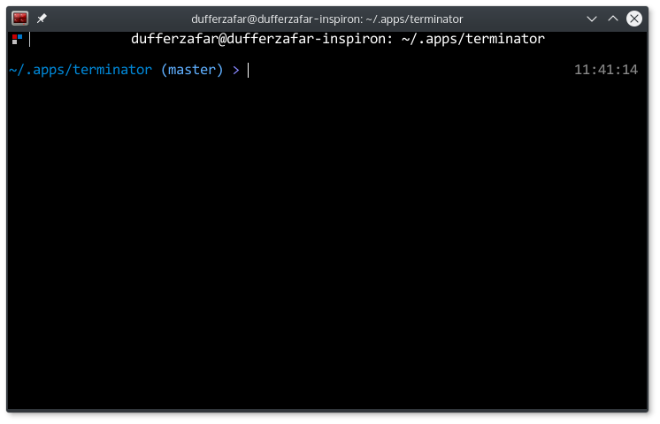

# Terminator

Checkout the [`launchpad`](https://github.com/dufferzafar/terminator/tree/launchpad) branch for the [bzr mirror](https://code.launchpad.net/~gnome-terminator/terminator/trunk). I use the [`_update_github_mirro.sh`](https://github.com/dufferzafar/terminator/blob/master/_update_github_mirror.sh) script to pull changes from bzr.

## Changes

* Scrollbar always remains hidden.